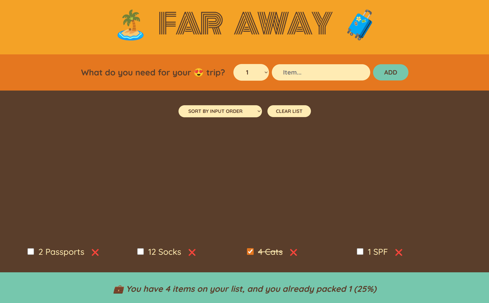

# 🧳 Far Away — список вещей для поездки

Интерактивное веб-приложение на **React**, которое помогает планировать сборы перед поездкой.  
Проект демонстрирует навыки работы с состоянием, управлением формами и рендерингом списков, а также организацию кода на компонентной архитектуре.

---

## ✨ Основные возможности

- ➕ **Добавление вещей** в список с указанием количества.
- 🔍 **Фильтры** для сортировки списка (по порядку добавления, по названию, по статусу).
- ✅ Возможность **отмечать собранные вещи** — они автоматически вычеркиваются.
- 📊 **Динамическая статистика** — отображает процент уже собранных вещей.

---

## 🛠️ Технологии

- ⚛️ **React** (хуки: `useState`, передача данных через `props`)
- 📜 **JavaScript (ES6+)**
- 🎨 **CSS** для оформления

---

